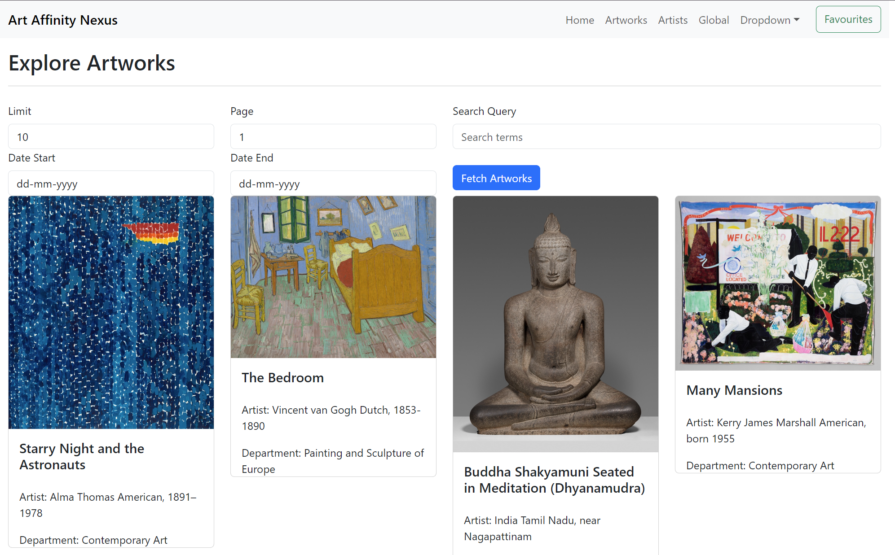
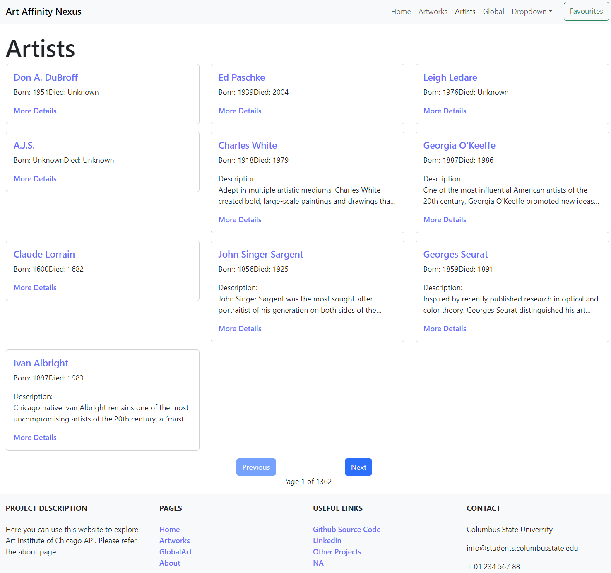
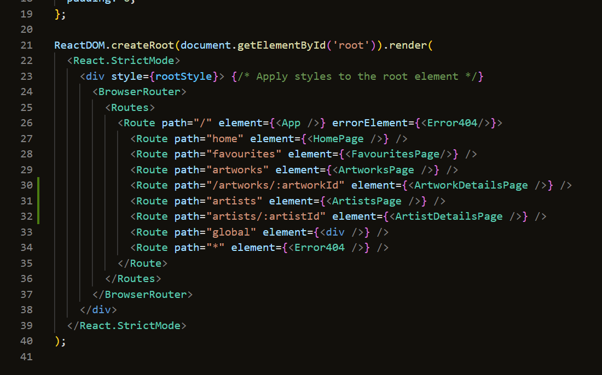

---

# Group_ArtGalleryProject

```
cd serverApp

sdk install java 17.0.10-amzn


gradle bootrun

```


## Team Project

### Team Members

- Swati Kasina
- Sindhu Yasa
- Vineetha Bandla

# Demo 3 Updates


## artworks page with query and page number fields


## Artwork details page


## Artists page


## Artist Details Page


## Dynamic Routes



Refer to the [API Documentation Link](https://api.artic.edu/docs/#collections) for details.

Using the `/artworks?limit=<int>` API endpoint.


---

## Steps to Run the Project

1. Go to [Gitpod](https://gipod.io/#/github.com/CSU-WebEngineering-Spr24/Group_ArtGalleryProject).

   **Note:** To contribute, fork the repo and use the forked repo.

2. Run the following commands to enable Java 17 on Gitpod:

   ```bash
   sudo apt update
   sudo apt install openjdk-17-jdk -y
   sudo update-alternatives --config java
   JAVA_HOME="/usr/lib/jvm/java-17-openjdk-amd64"
   export PATH=$JAVA_HOME/bin:$PATH
   ```

   Now proceed to compile the backend (optional).

3. Navigate to the `ArtGalleryFrontend` directory:

   ```bash
   cd ./ArtGalleryFrontend
   ```

   Install dependencies:

   ```bash
   npm install
   ```

   > Demo 2 frontend dominant changes, so run frontend
   Run the frontend:  [Pase 2]

   ```bash
   npm run dev
   ```

   Build the frontend:

   ```bash
   npm run build
   ```

4. Next, navigate to the backend directory:

   ```bash
   cd ../serverApp
   ```

   Build the backend:

   ```bash
   gradle build
   ```

   Run the backend:

   ```bash
   gradle bootrun
   ```

5. Click on "Open in Browser" to preview the application.

---

## Contribution Log

> Checkout https://github.com/orgs/CSU-WebEngineering-Spr24/projects/8/views/1 

### Done

- **Create Repository**
  - Assignees: [@sindhu-yasa](https://github.com/sindhu-yasa)
  - Description: Repository creation in progress.

- **Create SpringBoot Application with HelloWorld**
  - Assignees: [@Vineetha785](https://github.com/Vineetha785)
  - Description: SpringBoot application creation with a HelloWorld endpoint.

- **Create Frontend Application Skeleton**
  - Assignees: [@SwatiKasina](https://github.com/SwatiKasina)
  - Description: Frontend application skeleton setup.

- **Connect Frontend React and Springboot with Thymeleaf**
  - Assignees: [@sindhu-yasa](https://github.com/SwatiKasina)
  - Description: Connection between frontend React and SpringBoot with Thymeleaf in progress.

- **Backend SpringBoot Server Skeleton**
  - Assignees: [@SwatiKasina](https://github.com/SwatiKasina)
  - Description: Backend SpringBoot server skeleton setup.

- **Helloworld In Springboot**
  - Assignees: [@Vineetha785](https://github.com/SwatiKasina)
  - Description: HelloWorld implementation in SpringBoot.

### InProgress

- **Setup React router and setup routing templates**
  - Assignees: [@sindhu-yasa](https://github.com/sindhu-yasa)
  - Description: React router setup completed.

- **Setup remaining Phase 1 Get API s**
  - Assignees: [@SwatiKasina](https://github.com/SwatiKasina)
  - Description: Phase 1 Get API setup completed.

### Todo

- **Implement react router dom pages**
  - Assignees: 
  - Description: 

- **Implement react complied urls in index route as multiple values to prevent 404**
  - Assignees: 
  - Description:

- **Implement Search based Get APIs in detail**
  - Assignees: 
  - Description: 

- **Implement react logic to store favoutites by cache**
  - Assignees: 
  - Description:

- **Implement Global page with some external world map plugin**
  - Assignees: 
  - Description:
