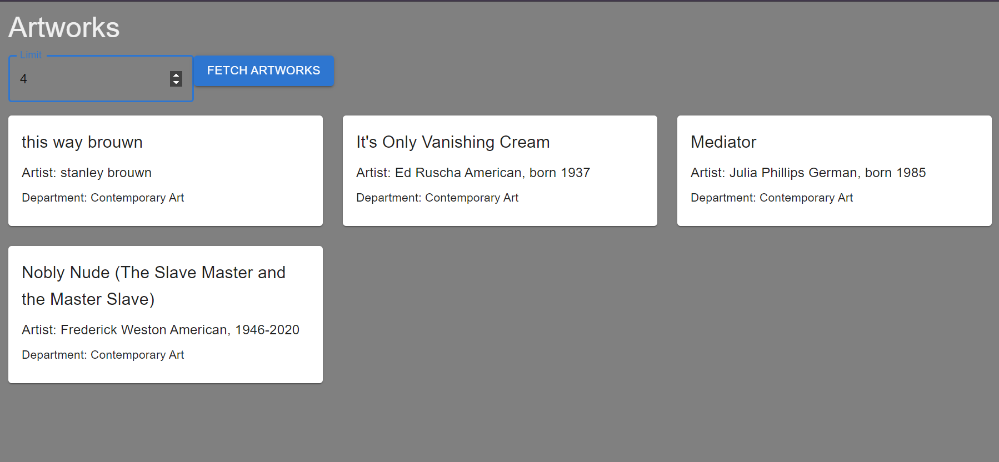

---

# Group_ArtGalleryProject

## Team Project

### Team Members

- Swati Kasina
- Sindhu Yasa
- Vineetha Bandla

Refer to the [API Documentation Link](https://api.artic.edu/docs/#collections) for details.

Using the `/artworks?limit=<int>` API endpoint.



---

## Steps to Run the Project

1. Go to [Gitpod](https://gipod.io/#/github.com/CSU-WebEngineering-Spr24/Group_ArtGalleryProject).

   **Note:** To contribute, fork the repo and use the forked repo.

2. Run the following commands to enable Java 17 on Gitpod:

   ```bash
   sudo apt update
   sudo apt install openjdk-17-jdk -y
   sudo update-alternatives --config java
   JAVA_HOME="/usr/lib/jvm/java-17-openjdk-amd64"
   export PATH=$JAVA_HOME/bin:$PATH
   ```

   Now proceed to compile the backend (optional).

3. Navigate to the `ArtGalleryFrontend` directory:

   ```bash
   cd ./ArtGalleryFrontend
   ```

   Install dependencies:

   ```bash
   npm install
   ```

   Build the frontend:

   ```bash
   npm run build
   ```

4. Next, navigate to the backend directory:

   ```bash
   cd ../serverApp
   ```

   Build the backend:

   ```bash
   gradle build
   ```

   Run the backend:

   ```bash
   gradle bootrun
   ```

5. Click on "Open in Browser" to preview the application.

---

